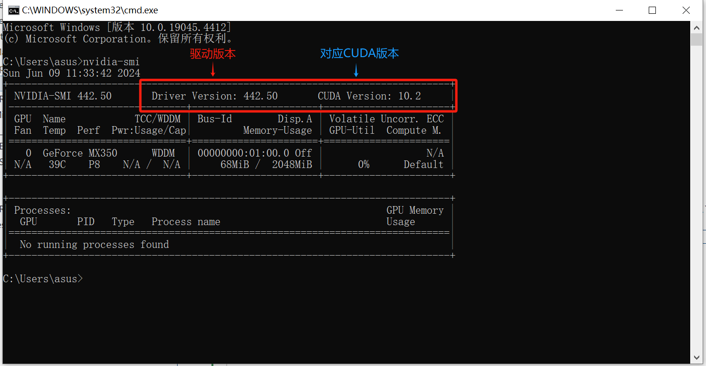
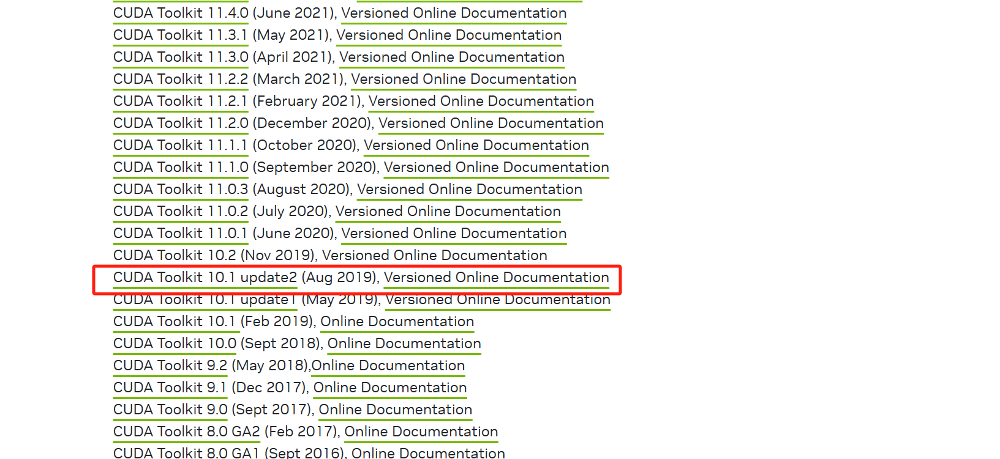
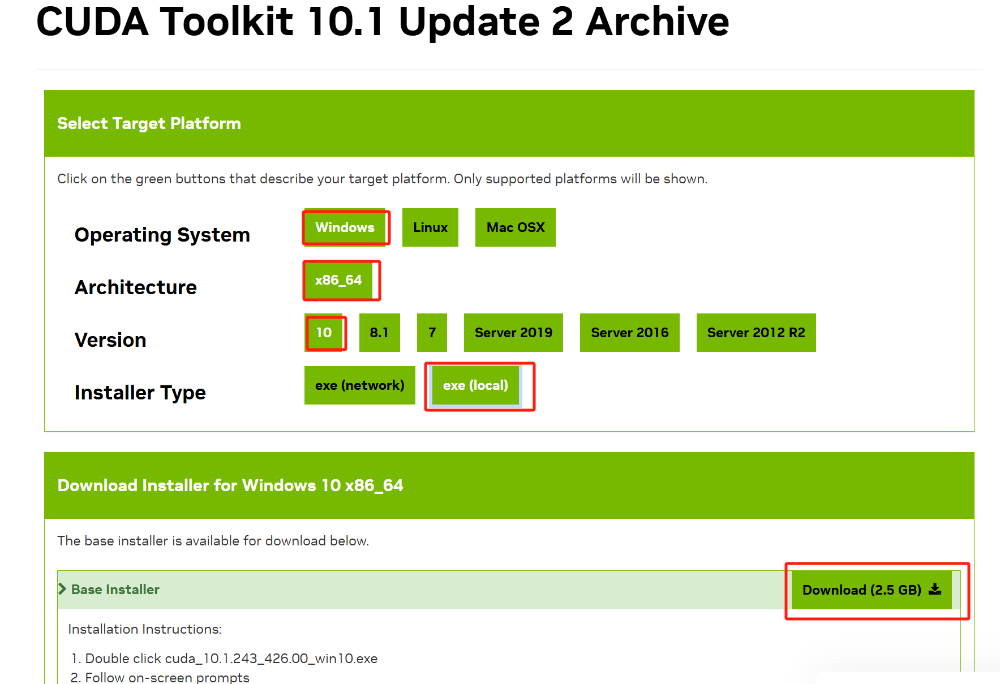
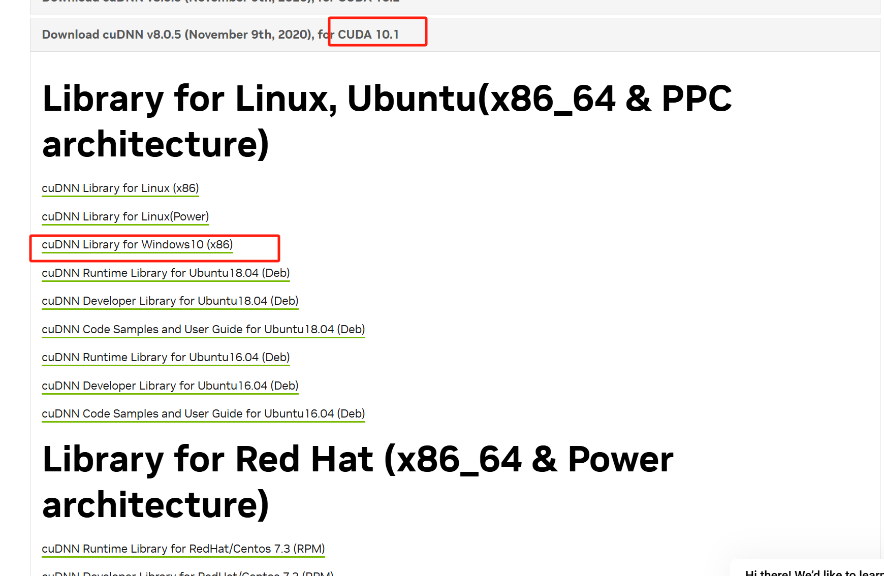
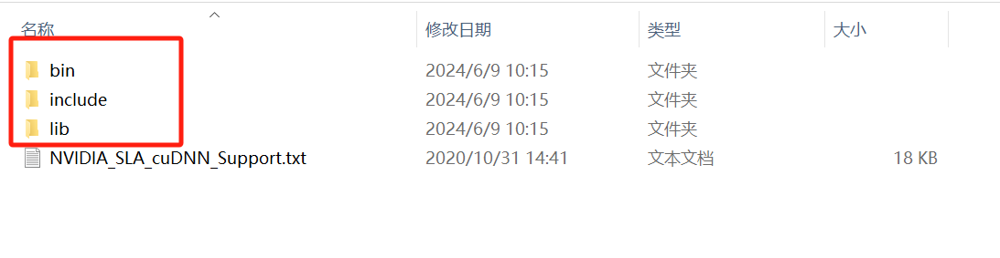
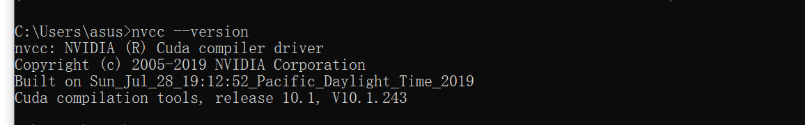
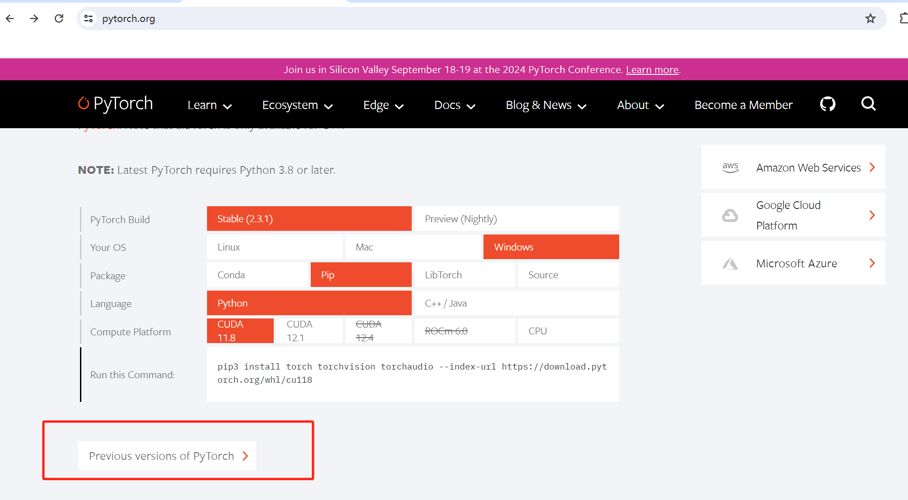
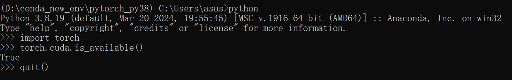

# Pytorch学习Day1-Pytorch安装

## 我的电脑配置以及最终pytorch环境配置

- Win10 笔记本
- NVIDIA GeForce MX350
- Driver Version: 442.50
- CUDA 10.1
- cuDNN v8.0.5
- Pytorch 1.7.1

## **安装步骤**

1. 安装Anaconda
2. 确认电脑是否有NVIDIA显卡
3. 查看显卡驱动版本
4. 安装CUDA Toolkit
5. 下载cuDNN
6. 创建虚拟环境
7. 安装Pytorch

---

### Step1: Anaconda安装

### Step2: 确认电脑是否有NVIDIA显卡


**查看方式：**在菜单栏搜索`设备管理器` -> 点击`显示适配器` -> 查看是否有NVIDIA显卡


### Step3: 查看电脑显卡驱动版本 Driver Version

CUDA toolkit的安装需要和驱动版本匹配，因此这里需要先查看电脑的驱动版本。

**查看方式：**按`win`键和`R`键 -> 输入`cmd`，按`Enter`键，打开命令提示符 -> 输入`nvidia-smi`（中间没有空格），查看驱动版本



### Step4: 安装CUDA Toolkit

根据上一步查看的Driver Version和CUDA版本，进入官网选择合适的CUDA Toolkit：<u>https://developer.nvidia.com/cuda-toolkit-archive</u>

**！注意：如果一直安装失败，torch.cuda.is_available()返回False，可以考虑换用较低低版本。例如：上面显示合适的CUDA版本是10.2，那么选择安装的CUDA Toolkit为10.1。**

这里选择**CUDA Toolkit 10.1 Update 2 Archive** -> 点击对应版本进入下一个页面 -> 依次选择，再下载 -> 默认安装路径`C:\Program Files\NVIDIA GPU Computing Toolkit\CUDA\v10.1` （这个路径后面需要用到）





### Step5: 下载cuDNN

1. 根据CUDA Toolkit版本，进入官网选择合适的cuDNN：<u>https://developer.nvidia.com/rdp/cudnn-archive</u>

  上一步安装的CUDA Toolkit为10.1，所以这里cuDNN选择v8.0.5

  

2. 解压cuDNN压缩包，将`bin`，`include`，`lib`，三个文件夹复制到CUDA toolkit安装目录下（默认安装路径：C:\Program Files\NVIDIA GPU Computing Toolkit\CUDA\v10.1）替换原有的文件夹

  

3. 确认CUDA Toolkit安装成功
  
  进入命令提示符 -> 输入`nvcc --version` 返回如下信息，表示安装成功。

  

### Step6: 创建虚拟环境

  不同的project可能需要不同的pytorch版本，因此需要建立不同的环境以满足。

  打开Anaconda Prompt -> 输入`conda create -n pytorch python=3.8`

  **！注意：如果CUDA Toolkit为10.1，需要选择python=3.8，否则后面安装Pytorch会失败，出现Found conflicts等报错。**

  ```
  #Create the environment(python=xx可以指定该环境下的python版本)
  conda create -n env_name python=xx

  conda create –-prefix=your_path python=xx

  #Activate the environment
  conda activate env_name

  #Deactivate the environment
  conda deactivate

  #Delete environment
  conda remove --name env_name --all
  ```

### Step7: 安装Pytorch

进入pytorch官网（<u>https://pytorch.org/</u>）-> 点击`Previous versions of Pytorch` -> 找到对应CUDA 10.1的conda安装命令并复制 -> 打开Anaconda Prompt -> 激活刚才创建的虚拟环境`conda activate pytorch` -> 将复制的命令粘贴过来并运行



```
# CUDA 10.1
conda install pytorch==1.7.1 torchvision==0.8.2 torchaudio==0.7.2 cudatoolkit=10.1 -c pytorch
```

**检查是否安装成功：**

在Anaconda Prompt窗口，为pytorch安装创建的虚拟环境下，输入`python` -> 进入代码模式，输入`import torch` -> 输入`torch.cuda.is_available()` -> 最终返回结果`True`表示安装成功

