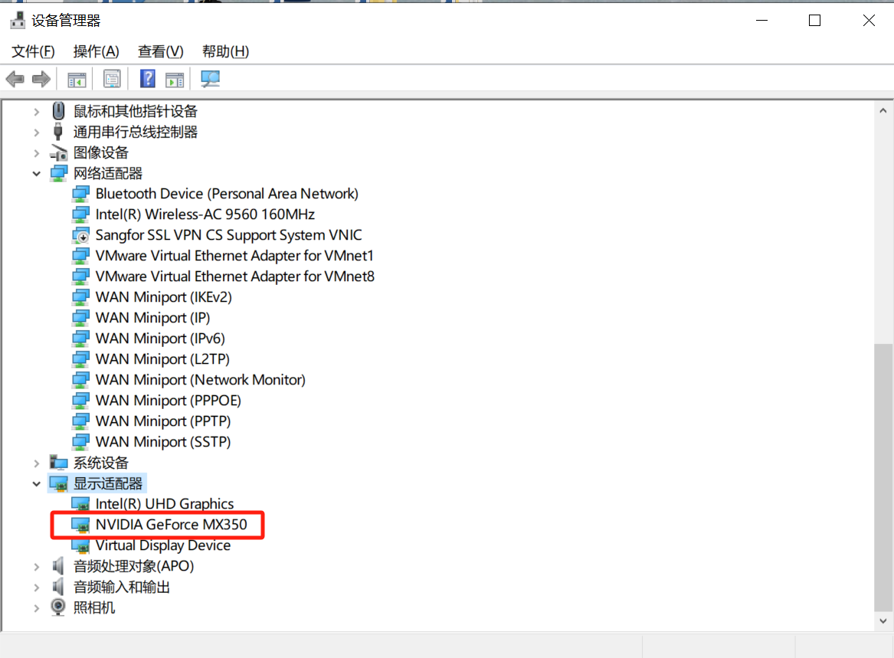

# Pytorch学习Day1-Pytorch安装

## 我的电脑配置以及最终pytorch环境配置

- Win10 笔记本
- NVIDIA GeForce MX350
- Driver Version: 442.50
- CUDA 10.1
- cuDNN v8.0.5
- Pytorch 1.7.1

## **安装步骤**

1. 安装Anaconda
2. 查看显卡驱动版本
3. 安装CUDA Toolkit
4. 下载cuDNN
5. 创建虚拟环境
6. 安装Pytorch

---

### Step1: Anaconda安装

### Step2: 查看电脑显卡驱动版本 Driver Version

CUDA toolkit的安装需要和驱动版本匹配，因此这里需要先查看电脑的驱动版本。

**查看方式**：按`win`键和`R`键 -> 输入`cmd`，按`Enter`键，打开命令提示符 -> 输入`nvidia-smi`，查看驱动版本



- Step3: 创建环境

  不同的project可能需要不同的pytorch版本，因此需要建立不同的环境以满足。

  ```
  #Create the environment(python=xx可以指定该环境下的python版本)
  conda create -n env_name python=xx

  conda create –-prefix=your_path

  #Activate the environment
  conda activate env_name

  #Deactivate the environment
  conda deactivate

  #Delete environment
  conda remove --name env_name --all
  ```

- Step4: pytorch安装
  
  1.进入pytorch官网进行下载配置选择

    https://pytorch.org/

  2.确认显卡是否支持CUDA
    
    打开命令行，输入`nvidia-smi`，即可查看`Driver Version`和`CUDA Version`

    开启管理员权限：https://blog.csdn.net/qq_42455031/article/details/121301716


