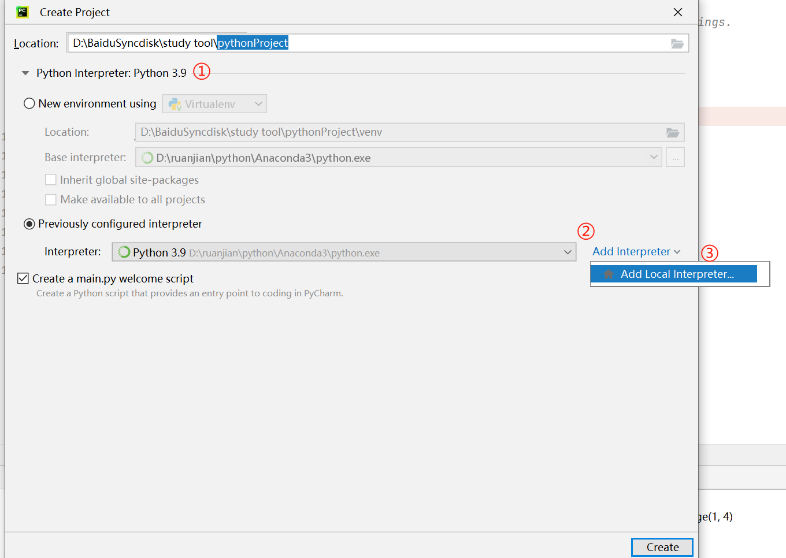
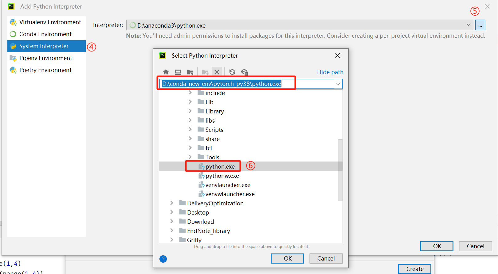
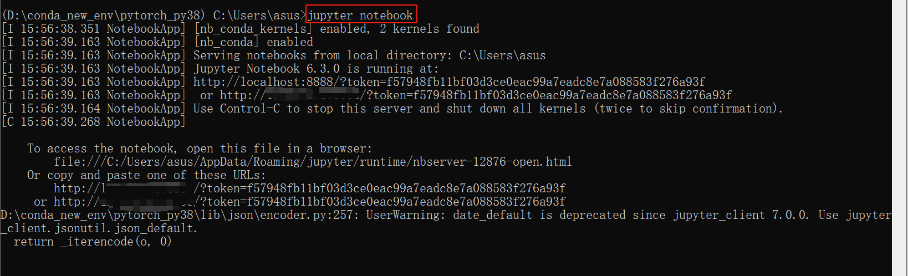
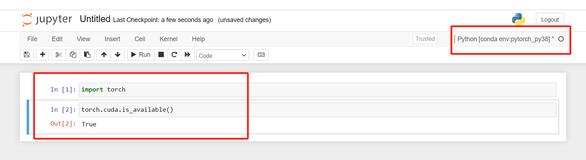
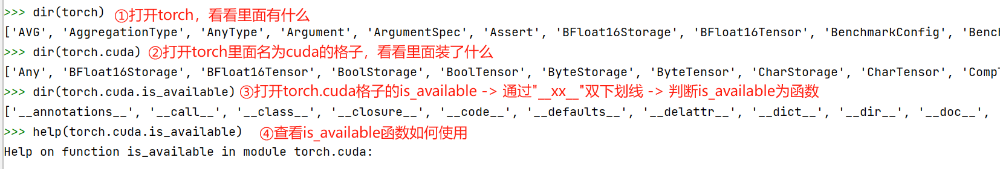

# Pytorch学习Day2-Pycharm以及Jupyter notebook配置Pytorch

## 学习内容：

1. 在Pycharm中使用Pytorch
2. 在Jupyter notebook中使用Pytorch
3. 

### 1. 在Pycharm中使用Pytorch

编译器使用之前创建的**安装有pytorch的虚拟环境中的**python.exe

### 2. 在Jupyter notebook使用Pytorch

在**安装了pytorch的虚拟环境中**安装Jupyter notebook

1. 打开Anaconda Prompt -> 激活虚拟环境 -> 输入以下命令安装Jupyter notebook

`conda install conda-forge::nb_conda`

2. 安装完成后，在命令行输入`jupyter notebook` -> Jupyter notebook页面将自动弹出

3. 创建新文件

点击`New` -> 选择创建的安装有pytorch的虚拟环境（这里就是pytorch_py38）

4. 检测是否安装成功

输入`import torch` -> 输入`torch.cuda.is_available()` -> 返回`True`，表示安装成功

### 3. 学习Pytorch/Package

- `import torch` -> 载入torch

- `dir()` -> 打开（看见有什么东西）
    dir(pytorch)
    
    输出:1,2,3,4

    dir(pytorch.3)

    输出：a,b,c,...

- `help()` -> 说明书（看见的东西该如何使用）
    help(pytorch.3.a)

    输出：将此扳手放在特定的地方，然后拧动

**具体应用**

